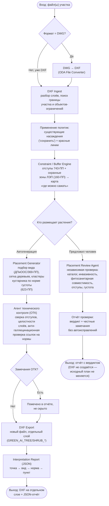

# Схема процесса — от входного DXF/DWG до выходного DXF

Обязательный документ по ТЗ (`docs/TASK_BRIEF.md`, §6.3: «схема процесса — предпочтительно BPMN (или UML Activity/flowchart)»). Формат — flowchart (Mermaid), допустимая по ТЗ альтернатива формальному BPMN-редактору. Отражает **реально реализованный** путь (Service A) — второй, вспомогательный сервис, изначально планировавшийся в архитектуре (Service B), по решению пользователя (2026-09-24) исключён из объёма проекта (см. `docs/SOLUTION_SCOPE.md`), поэтому на схеме не показан.

Два входа в один и тот же процесс — CLI (`pipeline.run`/`pipeline.review_run`) и веб-UI (`pipeline/web/app.py`) — вызывают одно и то же ядро, поэтому на схеме показан только сам процесс, без дублирования по способу запуска.

## Пояснение к развилкам

- **Формат = DWG?** — реальный датасет хакатона почти весь в DWG, не в DXF (см. `docs/DATA_STRUCTURE.md` §3); конвертация — обёртка над ODA File Converter с явной обработкой отсутствия конвертера, не тихий фолбэк.
- **Кто размещает растения?** — прямое архитектурное решение (2026-09-18): автогенерация и проверка человеческого выбора — два равноправных режима одного ядра, не один заменяет другой (`docs/CHECKLIST.md`, «Placement Review Agent»).
- **Замечания ОТК?** — по решению проекта (`docs/CHECKLIST.md`, «DXF Export Agent») экспорт сейчас не блокируется полным протоколом ОТК (агент ОТК пока не имеет всех 5 проверок, см. `docs/AGENTS_PLAN.md`) — замечания честно фиксируются в отчёте, а не приводят к отказу в выдаче результата.
- Ветка **«Предложил человек»** не создаёт новый DXF — по прямому решению пользователя сервис только проверяет и объясняет, не вносит правок в предложенную конфигурацию (см. `pipeline/review/placement_review.py`).
